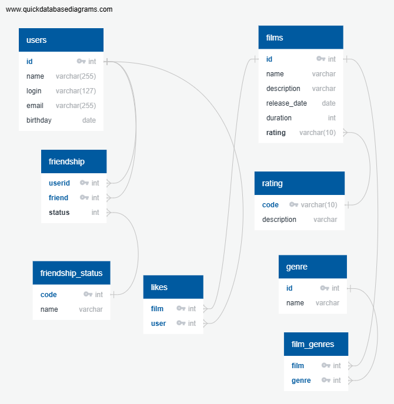

# java-filmorate
Template repository for Filmorate project.
<br>
## Схема БД

<br>
## Запросы

- Все фильмы с количеством лайков
```
SELECT f.id, 
	f.name, 
	f.description, 
	f.release_date,
	f.duration,
	f.rating,
	COUNT(l.user) AS likes_count
FROM films AS f
LEFT JOIN likes AS l ON f.id = l.film
GROUP BY f.id;
```

- Фильм по его id:
```
SELECT f.id, 
	f.name, 
	f.description, 
	f.release_date,
	f.duration,
	f.rating,
	COUNT(l.user) AS likes_count
FROM films AS f
LEFT JOIN likes AS l ON f.id = l.film
WHERE f.id = N
GROUP BY f.id;
```

- 10 популярных фильмов
```
SELECT f.id, 
	f.name, 
	f.description, 
	f.release_date,
	f.duration,
	f.rating,
	COUNT(l.user) AS likes_count
FROM films AS f
LEFT JOIN likes AS l ON f.id = l.film
GROUP BY f.id;
ORDER BY likes_count DESC
LIMIT 10
```

- Все юзеры:
```
SELECT * 
FROM users
```

- Все юзеры со списком id их друзей:
```
SELECT u.id, 
	u.name, 
	u.login, 
	u.email, 
	u.birthday,
    fr.friend
FROM users AS u
LEFT JOIN friendship AS fr ON u.id = fr.userid
```

- Список id друзей юзера 4
```
SELECT friend 
FROM friendship
WHERE userid = 4
```

- Список друзей юзера 5 со всеми полями и статусом:
```
SELECT 
	u.id, 
	u.name, 
	u.login, 
	u.email, 
	u.birthday, 
	fr.status, 
	fs.name 
FROM friendship AS fr
JOIN users AS u ON u.id = fr.userid AND fr.userid = 5
JOIN friendship_status fs ON fr.status = fs.code
```

- Общие друзья юзеров 5 и 6
```
SELECT u.id, 
	u.name, 
	u.login, 
	u.email, 
	u.birthday
FROM users u
JOIN friendship fr1 ON u.id = fr1.friend AND f1.userid = 5
JOIN friendship fr2 ON u.id = fr2.friend AND f2.userid = 6
```

